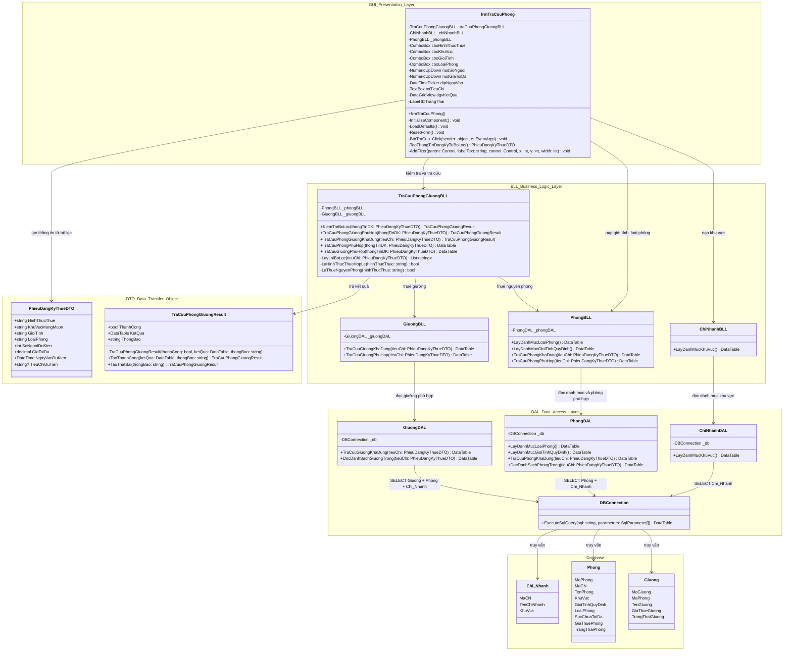

# Sơ đồ 3 lớp đầy đủ: Tra cứu phòng/giường phù hợp

## 1. Vì sao code BLL nhiều hàm hơn sơ đồ 3-layer ban đầu?

Sơ đồ 3-layer ban đầu đang vẽ ở mức tổng quát, chỉ thể hiện chức năng chính là **tra cứu phòng/giường phù hợp**. Trong code thật, BLL có thêm một số hàm để làm rõ luồng xử lý theo sequence:

| Nhóm hàm | Lý do tồn tại |
|---|---|
| `KiemTraBoLoc` | Tách bước kiểm tra bộ lọc thành một bước riêng đúng sequence. |
| `TraCuuPhongGiuongPhuHop` | Hàm điều phối chính: nhận DTO, xác định hình thức thuê, gọi nhánh phòng hoặc giường. |
| `TraCuuPhongPhuHop`, `TraCuuGiuongPhuHop` | Tách rõ 2 nhánh nghiệp vụ trong BLL. |
| `TraCuuPhongGiuongKhaDung` | Hàm alias để giữ tương thích với tên gọi cũ trong code. Có thể không cần vẽ nếu báo cáo chỉ mô tả nghiệp vụ mới. |
| `LayLoiBoLoc`, `LaHinhThucThueHopLe`, `LaThueNguyenPhong` | Hàm private hỗ trợ kiểm tra dữ liệu, không phải chức năng riêng của người dùng. |
| `TraCuuPhongGiuongResult` | Object trả kết quả gồm trạng thái thành công, bảng dữ liệu và thông báo hiển thị. |

Vì vậy, bản 3-layer đầy đủ nên thể hiện cả các hàm public chính và ghi chú các hàm private là hàm nội bộ.

## 2. Sơ đồ 3 lớp đầy đủ theo code hiện tại

## 3. Mapping chi tiết theo file code

| Lớp trong sơ đồ | File code | Vai trò |
|---|---|---|
| `frmTraCuuPhong` | `UI/DangKyThue/frmTraCuuPhong.cs` | Màn hình nhập bộ lọc, tạo DTO, gọi BLL, hiển thị kết quả. |
| `PhieuDangKyThueDTO` | `DTO/PhieuDangKyThueDTO.cs` | DTO truyền tiêu chí tra cứu từ GUI xuống BLL/DAL. |
| `TraCuuPhongGiuongResult` | `BLL/DangKyThue/TraCuuPhongGiuongBLL.cs` | Object trả kết quả xử lý về GUI. |
| `TraCuuPhongGiuongBLL` | `BLL/DangKyThue/TraCuuPhongGiuongBLL.cs` | Kiểm tra bộ lọc, điều phối nhánh tra cứu phòng hoặc giường. |
| `ChiNhanhBLL` | `BLL/QuanTriHeThong/ChiNhanhBLL.cs` | Lấy danh mục khu vực cho combobox. |
| `PhongBLL` | `BLL/QuanTriHeThong/PhongBLL.cs` | Lấy danh mục loại phòng/giới tính và xử lý nhánh tra cứu phòng. |
| `GiuongBLL` | `BLL/QuanTriHeThong/GiuongBLL.cs` | Xử lý nhánh tra cứu giường. |
| `ChiNhanhDAL` | `DAL/QuanTriHeThong/ChiNhanhDAL.cs` | Đọc danh mục khu vực từ bảng `Chi_Nhanh`. |
| `PhongDAL` | `DAL/QuanTriHeThong/PhongDAL.cs` | Đọc danh mục phòng và danh sách phòng trống/phù hợp. |
| `GiuongDAL` | `DAL/QuanTriHeThong/GiuongDAL.cs` | Đọc danh sách giường trống/phù hợp. |
| `DBConnection` | `DAL/DBConnection.cs` | Thực thi truy vấn SQL và trả về `DataTable`. |

## 4. Luồng gọi đúng theo code

1. `frmTraCuuPhong.BtnTraCuu_Click()`
2. `frmTraCuuPhong.TaoThongTinDangKyTuBoLoc()`
3. `TraCuuPhongGiuongBLL.KiemTraBoLoc(thongTinDK)`
4. Nếu bộ lọc không hợp lệ, trả `TraCuuPhongGiuongResult.TaoThatBai(...)`.
5. Nếu bộ lọc hợp lệ, gọi `TraCuuPhongGiuongBLL.TraCuuPhongGiuongPhuHop(thongTinDK)`.
6. Nếu hình thức thuê là `Thuê nguyên phòng`, gọi:
   `TraCuuPhongGiuongBLL.TraCuuPhongPhuHop()` -> `PhongBLL.TraCuuPhongPhuHop()` -> `PhongDAL.DocDanhSachPhongTrong()`.
7. Nếu hình thức thuê là `Thuê giường`, gọi:
   `TraCuuPhongGiuongBLL.TraCuuGiuongPhuHop()` -> `GiuongBLL.TraCuuGiuongPhuHop()` -> `GiuongDAL.DocDanhSachGiuongTrong()`.
8. BLL đóng gói kết quả vào `TraCuuPhongGiuongResult`.
9. GUI bind `KetQua` lên `dgvKetQua` và hiển thị `ThongBao`.

## 5. Ghi chú khi đưa vào báo cáo

- Nếu báo cáo cần sơ đồ ngắn gọn, có thể bỏ các hàm private: `LayLoiBoLoc`, `LaHinhThucThueHopLe`, `LaThueNguyenPhong`.
- Nếu báo cáo cần khớp code 100%, giữ đầy đủ như sơ đồ ở mục 2.
- `TraCuuPhongGiuongKhaDung` là tên cũ/alias để tương thích code, còn tên đúng theo đặc tả mới là `TraCuuPhongGiuongPhuHop`.
- `TraCuuPhongGiuongResult` hiện nằm trong file BLL nhưng về vai trò có thể xem như response DTO trả từ BLL về GUI.
