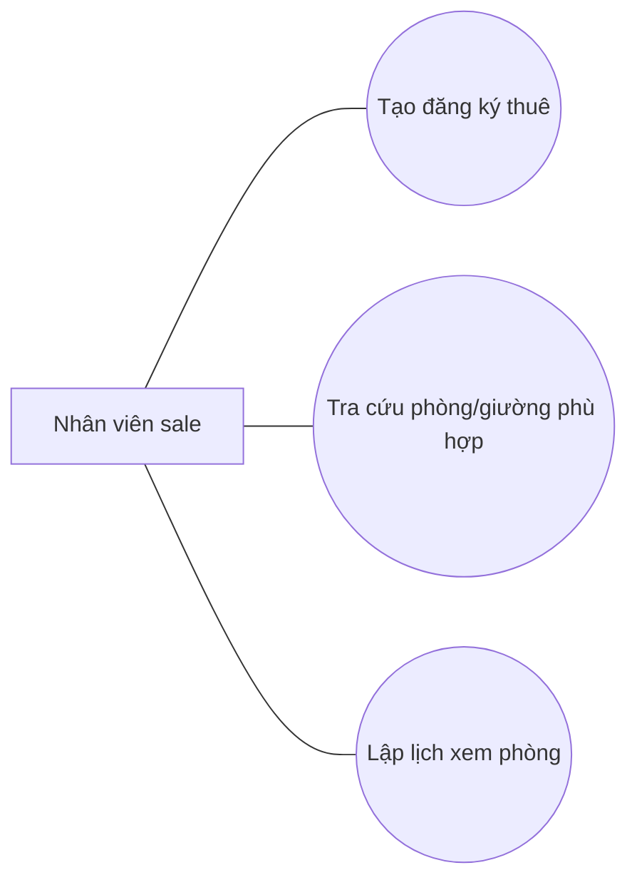
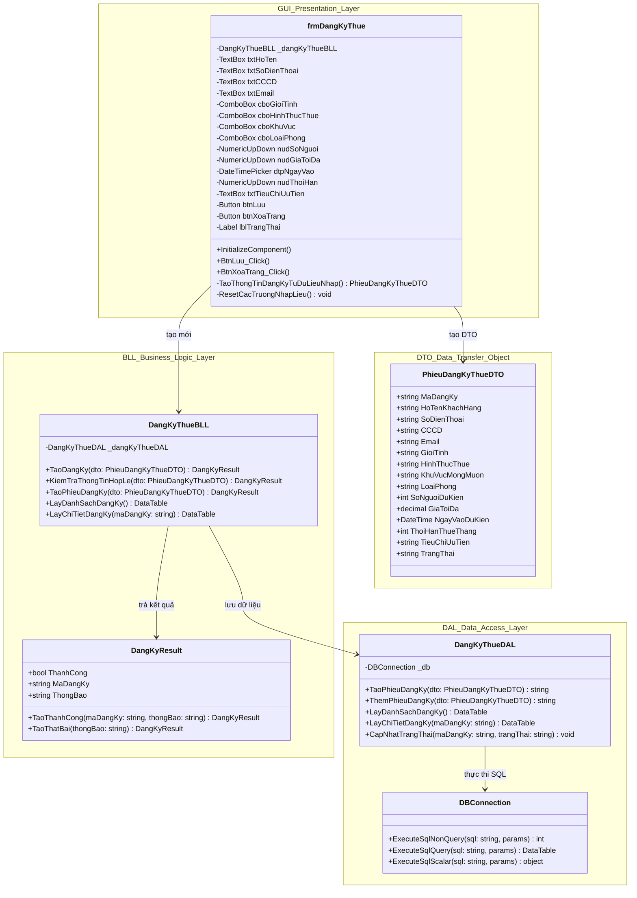
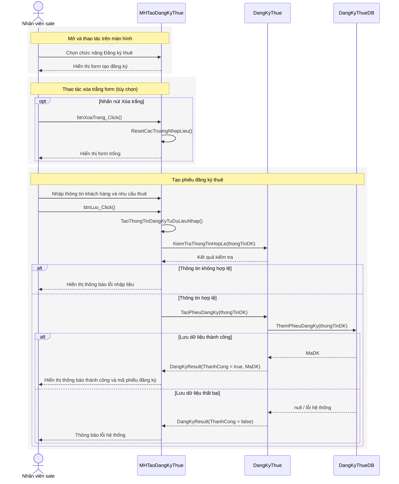
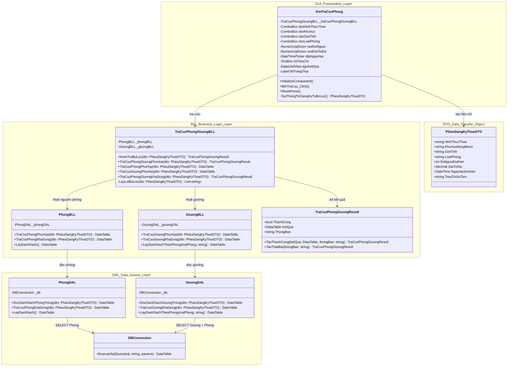
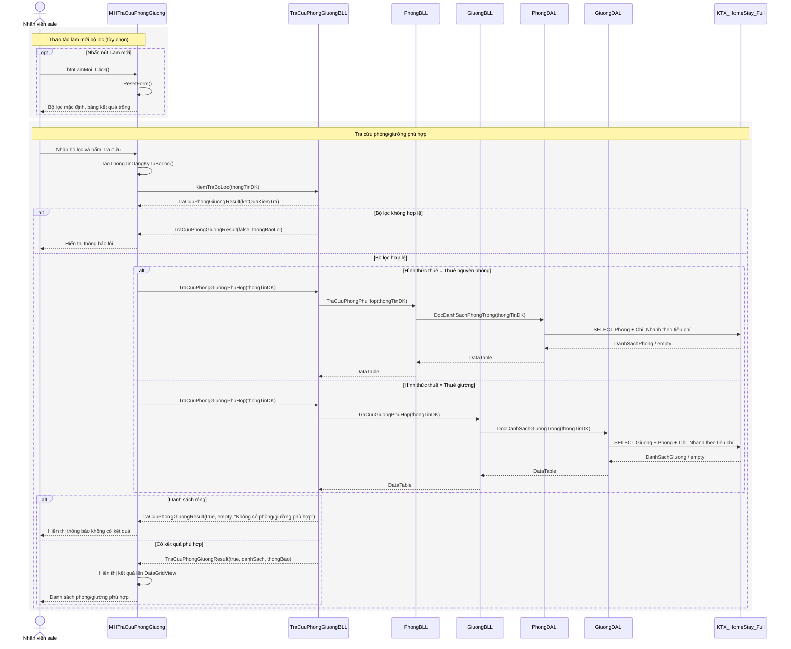

# Điều chỉnh UC hệ thống: Tạo đăng ký thuê và Tra cứu phòng/giường phù hợp

## 1. Lý do điều chỉnh

Trong dashboard phần mềm, **Đăng ký thuê** và **Tra cứu phòng** là 2 feature riêng biệt. Vì vậy trong sơ đồ use-case hệ thống và đặc tả use-case hệ thống, hai chức năng này nên được tách thành 2 use-case độc lập.

Điều chỉnh cần áp dụng:

- Không mô hình hóa `Tra cứu phòng/giường phù hợp` là `<<include>>` hoặc `<<extend>>` của `Tạo đăng ký thuê`.
- `Tạo đăng ký thuê` chỉ chịu trách nhiệm ghi nhận thông tin khách hàng và nhu cầu thuê, sau đó lưu phiếu đăng ký.
- `Tra cứu phòng/giường phù hợp` là use-case riêng, cho phép nhân viên sale nhập bộ lọc và xem danh sách phòng/giường phù hợp mà không bắt buộc phải có phiếu đăng ký.
- Trong sơ đồ UC hệ thống, thêm một association trực tiếp từ actor `Nhân viên sale` đến use-case `Tra cứu phòng/giường phù hợp`.

## 2. Điều chỉnh sơ đồ UC hệ thống

Thay quan hệ cũ:

```text
Nhân viên sale --> Tạo đăng ký thuê
Tạo đăng ký thuê <<include>> Tra cứu phòng/giường khả dụng
```

Bằng mô hình mới:



Ghi chú: `Tra cứu phòng/giường phù hợp` không có quan hệ `include` hoặc `extend` với `Tạo đăng ký thuê`.

## 3. Đặc tả UC hệ thống: Tạo đăng ký thuê

| Trường | Nội dung |
|---|---|
| Tên use-case | Tạo đăng ký thuê |
| Mô tả | Cho phép nhân viên sale tạo phiếu đăng ký thuê phòng/giường dựa trên thông tin khách hàng và nhu cầu thuê do khách hàng cung cấp. |
| Actor | Nhân viên sale |
| Điều kiện kích hoạt | Nhân viên sale chọn chức năng **Đăng ký thuê** trên Dashboard. |
| Tiền điều kiện | Nhân viên sale đã đăng nhập vào hệ thống. |
| Hậu điều kiện thành công | Phiếu đăng ký thuê được lưu trên hệ thống với trạng thái `Mới tạo`. Thông tin khách hàng liên quan được ghi nhận. |
| Hậu điều kiện thất bại | Không phát sinh phiếu đăng ký mới. Hệ thống hiển thị thông báo lỗi để nhân viên chỉnh sửa dữ liệu. |

### Luồng sự kiện chính

1. Hệ thống hiển thị màn hình **Tạo đăng ký thuê**.
2. Nhân viên sale nhập thông tin khách hàng: họ tên, số điện thoại, CCCD/CMND, email, giới tính.
3. Nhân viên sale nhập nhu cầu thuê: hình thức thuê, khu vực mong muốn, loại phòng, số người, giá tối đa, ngày vào dự kiến, thời hạn thuê, tiêu chí ưu tiên.
4. Nhân viên sale bấm **Lưu phiếu đăng ký**.
5. Hệ thống kiểm tra tính hợp lệ của thông tin đăng ký.
6. Hệ thống lưu thông tin khách hàng.
7. Hệ thống lưu phiếu đăng ký thuê.
8. Hệ thống hiển thị mã phiếu đăng ký vừa tạo.

### Luồng sự kiện phụ

**A5 - Thông tin không hợp lệ**

1. Tại bước 5, nếu thông tin bắt buộc bị thiếu hoặc không hợp lệ, hệ thống hiển thị thông báo lỗi.
2. Nhân viên sale bổ sung hoặc chỉnh sửa thông tin.
3. Quay lại bước 4.

**A6 - Không thể lưu thông tin khách hàng**

1. Tại bước 6, nếu dữ liệu khách hàng bị trùng khóa hoặc không thể ghi xuống CSDL, hệ thống hiển thị thông báo lỗi.
2. Nhân viên sale kiểm tra lại CCCD/CMND, số điện thoại hoặc liên hệ quản trị hệ thống.
3. UC kết thúc ở trạng thái thất bại nếu không thể lưu dữ liệu.

**A7 - Không thể tạo phiếu đăng ký**

1. Tại bước 7, nếu hệ thống không thể tạo phiếu đăng ký thuê, hệ thống hiển thị thông báo lỗi.
2. Không có phiếu đăng ký mới được ghi nhận.

### Quy tắc nghiệp vụ

- Họ tên khách hàng và số điện thoại là bắt buộc.
- Hình thức thuê chỉ nhận một trong các giá trị: `Thuê nguyên phòng`, `Thuê giường`.
- Số người dự kiến ở phải lớn hơn 0.
- Mức giá tối đa phải lớn hơn 0.
- Ngày vào dự kiến không được nhỏ hơn ngày hiện tại.
- Thời hạn thuê phải lớn hơn 0 tháng.
- UC này không tự động tra cứu phòng/giường sau khi lưu phiếu.

## 4. Sơ đồ 3 lớp cho GUI Tạo đăng ký thuê



### Mapping code

| Lớp | Thành phần |
|---|---|
| GUI | `UI/DangKyThue/frmDangKyThue.cs` |
| DTO | `DTO/PhieuDangKyThueDTO.cs` |
| BLL | `BLL/DangKyThue/DangKyThueBLL.cs` |
| DAL | `DAL/DangKyThue/DangKyThueDAL.cs` |
| Database | `Khach_hang`, `Dang_ky_thue` |

## 5. Sequence cho GUI Tạo đăng ký thuê



Ghi chú: Sequence này chỉ mô tả UC `Tạo đăng ký thuê`. Không gọi `Tra cứu phòng/giường phù hợp` sau khi lưu phiếu.

## 6. Đặc tả UC hệ thống: Tra cứu phòng/giường phù hợp

| Trường | Nội dung |
|---|---|
| Tên use-case | Tra cứu phòng/giường phù hợp |
| Mô tả | Cho phép nhân viên sale nhập tiêu chí tìm kiếm để tra cứu danh sách phòng hoặc giường còn phù hợp với nhu cầu thuê. UC này chỉ đọc dữ liệu và hiển thị kết quả, không tạo phiếu đăng ký thuê. |
| Actor | Nhân viên sale |
| Điều kiện kích hoạt | Nhân viên sale chọn chức năng **Tra cứu phòng** trên Dashboard. |
| Tiền điều kiện | Nhân viên sale đã đăng nhập vào hệ thống. Dữ liệu phòng, giường và chi nhánh đã tồn tại trong hệ thống. |
| Hậu điều kiện thành công | Danh sách phòng/giường phù hợp được hiển thị trên màn hình. |
| Hậu điều kiện thất bại | Không thay đổi dữ liệu hệ thống. Hệ thống hiển thị thông báo lỗi hoặc thông báo không có kết quả phù hợp. |

### Luồng sự kiện chính

1. Hệ thống hiển thị màn hình **Tra cứu phòng/giường khả dụng**.
2. Nhân viên sale nhập hoặc chọn bộ lọc: hình thức thuê, khu vực, giới tính, loại phòng, số người, giá tối đa, ngày vào dự kiến, tiêu chí ưu tiên.
3. Nhân viên sale bấm **Tra cứu**.
4. Hệ thống kiểm tra tính hợp lệ của bộ lọc.
5. Hệ thống xác định loại đối tượng cần tra cứu theo hình thức thuê:
   - Nếu `Thuê nguyên phòng`, hệ thống tra cứu danh sách phòng phù hợp.
   - Nếu `Thuê giường`, hệ thống tra cứu danh sách giường phù hợp.
6. Hệ thống lọc dữ liệu theo trạng thái còn khả dụng, khu vực, giới tính, loại phòng, sức chứa và mức giá.
7. Hệ thống hiển thị danh sách phòng/giường phù hợp.
8. Nhân viên sale có thể bấm **Làm mới** để nhập lại bộ lọc hoặc đóng màn hình.

### Luồng sự kiện phụ

**A4 - Bộ lọc không hợp lệ**

1. Tại bước 4, nếu thiếu tiêu chí bắt buộc hoặc dữ liệu không hợp lệ, hệ thống hiển thị thông báo lỗi.
2. Nhân viên sale chỉnh sửa bộ lọc.
3. Quay lại bước 3.

**A7 - Không có kết quả phù hợp**

1. Tại bước 7, nếu không tìm thấy phòng/giường phù hợp, hệ thống hiển thị thông báo `Không có phòng/giường phù hợp`.
2. Nhân viên sale có thể điều chỉnh bộ lọc và tra cứu lại.

**A6 - Không thể truy vấn dữ liệu**

1. Tại bước 6, nếu hệ thống không thể kết nối hoặc truy vấn CSDL, hệ thống hiển thị thông báo lỗi.
2. UC kết thúc ở trạng thái thất bại.

### Quy tắc nghiệp vụ

- UC này không yêu cầu mã phiếu đăng ký thuê.
- UC này không tạo, sửa, xóa phiếu đăng ký thuê.
- Hình thức `Thuê nguyên phòng` trả về danh sách phòng.
- Hình thức `Thuê giường` trả về danh sách giường kèm thông tin phòng.
- Chỉ hiển thị phòng/giường đang còn khả dụng theo dữ liệu hiện tại.

## 7. Sơ đồ 3 lớp cho GUI Tra cứu phòng/giường phù hợp



### Mapping code

| Lớp | Thành phần |
|---|---|
| GUI | `UI/DangKyThue/frmTraCuuPhong.cs` |
| DTO | `DTO/PhieuDangKyThueDTO.cs` |
| BLL điều phối tra cứu | `BLL/DangKyThue/TraCuuPhongGiuongBLL.cs` |
| BLL danh mục | `BLL/QuanTriHeThong/PhongBLL.cs`, `BLL/QuanTriHeThong/GiuongBLL.cs` |
| DAL | `DAL/QuanTriHeThong/PhongDAL.cs`, `DAL/QuanTriHeThong/GiuongDAL.cs` |
| Database | `Chi_Nhanh`, `Phong`, `Giuong` |

## 8. Sequence cho GUI Tra cứu phòng/giường phù hợp



## 9. Nguồn dữ liệu combobox/danh mục

Nguyên tắc điều chỉnh: dữ liệu nào đã tồn tại dưới dạng danh mục trong CSDL thì lấy động từ DB; chỉ giữ cố định các giá trị mang tính enum nghiệp vụ hoặc trạng thái hệ thống.

| Màn hình | Trường | Nguồn dữ liệu | Ghi chú |
|---|---|---|---|
| Tạo đăng ký thuê | Hình thức thuê | Cố định trong BLL | Enum nghiệp vụ: `Thuê nguyên phòng`, `Thuê giường`. |
| Tạo đăng ký thuê | Khu vực | DB: `Chi_Nhanh.KhuVuc` | Có fallback `Quận 1`, `Bình Thạnh` nếu DB chưa có dữ liệu. |
| Tạo đăng ký thuê | Giới tính | DB: `Phong.GioiTinhQuyDinh` | Có fallback `Nam`, `Nữ`, `Không yêu cầu`. |
| Tạo đăng ký thuê | Loại phòng | DB: `Phong.LoaiPhong` | Có fallback `Phòng 4 Người`, `Phòng Đơn`. |
| Tra cứu phòng/giường | Hình thức thuê | Cố định trong BLL | Enum nghiệp vụ. |
| Tra cứu phòng/giường | Khu vực | DB: `Chi_Nhanh.KhuVuc` | Dùng làm tiêu chí lọc phòng/giường. |
| Tra cứu phòng/giường | Giới tính | DB: `Phong.GioiTinhQuyDinh` | Dùng làm tiêu chí lọc. |
| Tra cứu phòng/giường | Loại phòng | DB: `Phong.LoaiPhong` | Dùng làm tiêu chí lọc. |
| Quản lý phòng/giường | Chi nhánh | DB: `Chi_Nhanh` | Combobox hiển thị tên chi nhánh, lưu `MaCN`. |
| Quản lý phòng/giường | Loại phòng | DB: `Phong.LoaiPhong` | Có fallback để vẫn nhập được khi DB ít dữ liệu. |
| Quản lý phòng/giường | Giới tính quy định | DB: `Phong.GioiTinhQuyDinh` | Có fallback các giá trị chuẩn. |
| Quản lý phòng/giường | Phòng khi thêm giường | DB: `Phong` | Combobox hiển thị tên phòng, lưu `MaPhong`. |
| Quản lý phòng/giường | Trạng thái phòng/giường | Cố định trong UI | Trạng thái hệ thống: `Hoạt động`, `Ngừng sử dụng`, `Trống`, `Đã thuê`. |
| Quản lý nhân viên | Vai trò | DB: `Nhan_Vien.VaiTro` | Có fallback `Sale`, `Quản lý`, `Kế toán`. |
| Quản lý nhân viên | Chi nhánh | DB: `Chi_Nhanh` | Combobox hiển thị tên chi nhánh, lưu `MaCN`. |
| Quản lý nhân viên | Trạng thái | Cố định trong UI | Suy ra từ trạng thái tài khoản: `Đang làm`, `Nghỉ việc`. |
| Quản lý chi nhánh | Trạng thái | Cố định trong UI | Trạng thái hệ thống của chi nhánh. |

Các hàm hỗ trợ lấy danh mục động:

- `ChiNhanhBLL.LayDanhMucKhuVuc()`
- `PhongBLL.LayDanhMucLoaiPhong()`
- `PhongBLL.LayDanhMucGioiTinhQuyDinh()`
- `NhanVienBLL.LayDanhMucVaiTro()`

## 10. Tóm tắt thay thế trong báo cáo

Nên thay mục cũ **"Tạo đăng ký thuê / Tra cứu phòng/giường khả dụng"** bằng 2 mục riêng:

1. **Tạo đăng ký thuê**
   - Chỉ tạo phiếu đăng ký thuê.
   - Không gọi tra cứu phòng/giường.

2. **Tra cứu phòng/giường phù hợp**
   - UC riêng của actor `Nhân viên sale`.
   - Không `include` hoặc `extend` với `Tạo đăng ký thuê`.
   - Không yêu cầu phải có phiếu đăng ký thuê trước khi tra cứu.
